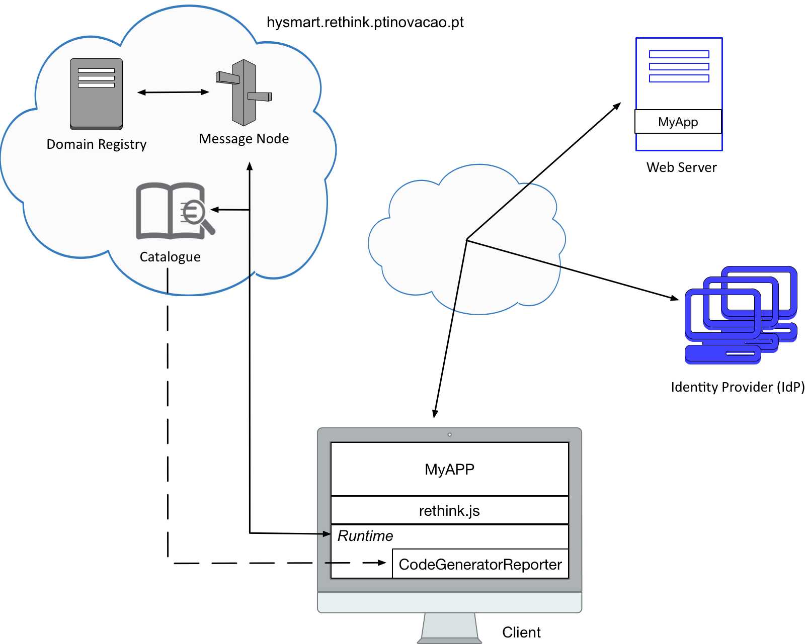

# 1st Challenge

Each team should develop a web application that uses the `Code Generator Reporter` hyperty that can be deployed from the `hysmart.rethink.ptinovacao.pt` catalogue. This hyperty generates a code according to the name of each team, which should be passed as input. The resulting code should be shown in the developed application.   



To overcome this first challenge, each team should accomplish all the tasks bellow. 
Your feedback is extremely important for us, in order to improve the reTHINK framework in the future. As such, after completing all the tasks, each team must fill out page 2 of this [Survey](https://docs.google.com/forms/d/e/1FAIpQLSeFt56Ura0zkTqg_VX9od_jBZtE3-2mt_urTFvxsoRuQ3uJRw/viewform). 

### Note: If you do not fill out this Survey, your participation won't be considered! 

## Task 1 (`estimate: 45 minutes`)

### Task 1.1:

`reTHINK distribution files` - To deploy the reTHINK runtime in your web application, it is necessary to execute `rethink.js`. 


<!-- There are two ways to obtain this script:

* Clone the `dev-runtime-browser` repository using the following command and copy the `bin` folder into the root of your application 

```shell
# Clone the runtime-browser repository:
$ git clone --branch=develop https://github.com/reTHINK-project/dev-runtime-browser.git
```
-->

* Add into your index.html the rethink file script

```html
<!DOCTYPE html>
<html>
  <head>
    <meta name="viewport" content="width=device-width, initial-scale=1.0">

    <script src="https://hysmart.rethink.ptinovacao.pt/.well-known/runtime/rethink.js"></script> 
  </head>
  <body>
  </body>
</html> 
```

### Task 1.2:

`Load Runtime` - the reTHINK runtime can be obtained after the execution of the `rethink.js` script by your application.

```javascript
rethink.default.install({ 
  domain: 'hysmart.rethink.ptinovacao.pt',
  development: true,
  runtimeURL: 'hyperty-catalogue://catalogue.hysmart.rethink.ptinovacao.pt/.well-known/runtime/Runtime'
  }).then((runtime) => {
    ... 
});
```


### Task 1.3:

`Load an Hyperty` - An Hyperty can be loaded using `requireHyperty()` method. For this challenge, the `Code Generator Reporter` hyperty, which is ready to be used in `hysmart.rethink.ptinovacao.pt` catalogue, should be loaded. To deploy it in a successful manner, authentication is mandatory.

```javascript
const hypertyURI = (hyperty_domain, hyperty) => 
`hyperty-catalogue://catalogue.${hyperty_domain}/.well-known/hyperty/${hyperty}`;

runtime.requireHyperty(hypertyURI('hysmart.rethink.ptinovacao.pt', 'CodeGeneratorReporter'))
.then((CodeGeneratorReporter) => {
  ...
});
```

## Task 2 (`estimate: 30 minutes`)

`Generate a code` - The generated code depends on the name of each team, which should be passed as input.

```javascript
CodeGeneratorReporter.generateCode(team_name).then((code) => {
  ...
});
```

#### Note: Don't forget to display the generated code on your developed application (HTML page).

##

### [Survey Page 2!!!](https://docs.google.com/forms/d/e/1FAIpQLSeFt56Ura0zkTqg_VX9od_jBZtE3-2mt_urTFvxsoRuQ3uJRw/viewform) 
