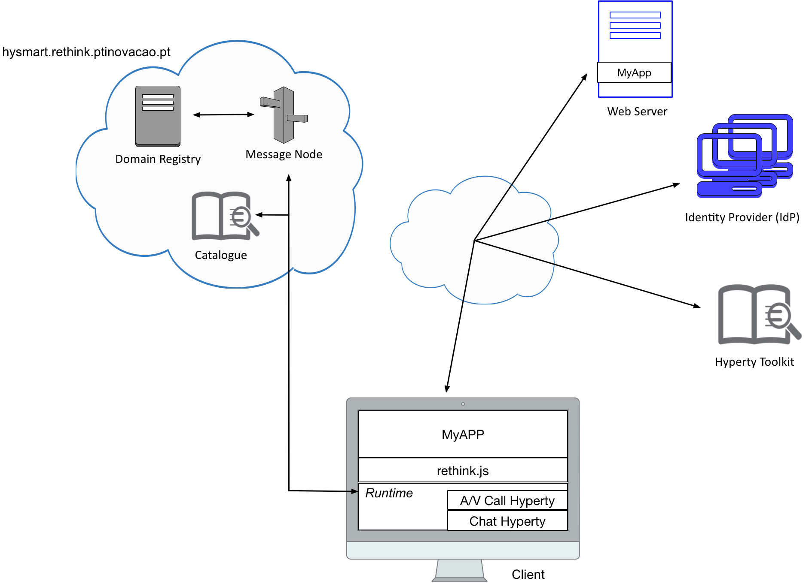

# 4th Challenge

Each team should develop a video conference application. This application should cover the following requirements:

 * Creation of chat rooms with the possibility of inviting users to join it
 
 * Notification about invitation to join a chat room, with the option to accept or reject

 * Send message to chat room (group)

 * Receive message from chat room, displaying the identity of the sender
 
 * A/V calls between users
 
 * Notification about invitation to join a A/V call, with the option to accept or reject
 
 * It should be possible to make A/V calls at the same time that a chat room is available (exchanging messages)

To overcome this fourth challenge, each team can choose from hyperties already available to handle some of the requirements (`dev-hyperty` repository) or develop their own hyperties. We will valued teams who try to develop new hyperties or change the available hyperties, in terms of functionalities.
Read carefully the documentation available at the root of this repository. It will be very useful in order to complete this challenge.
Your application must cover all the requirements presented above.

Your feedback is extremely important for us in order to improve the reTHINK framework in the future. As such, after complete all the tasks, each team must fill out the page 5 of this [Survey](https://docs.google.com/forms/d/e/1FAIpQLSeFt56Ura0zkTqg_VX9od_jBZtE3-2mt_urTFvxsoRuQ3uJRw/viewform). 

### Note: If you do not fill out this form, your participation will not be considered! 

##

### [Survey Page 5!!!](https://docs.google.com/forms/d/e/1FAIpQLSeFt56Ura0zkTqg_VX9od_jBZtE3-2mt_urTFvxsoRuQ3uJRw/viewform) 
