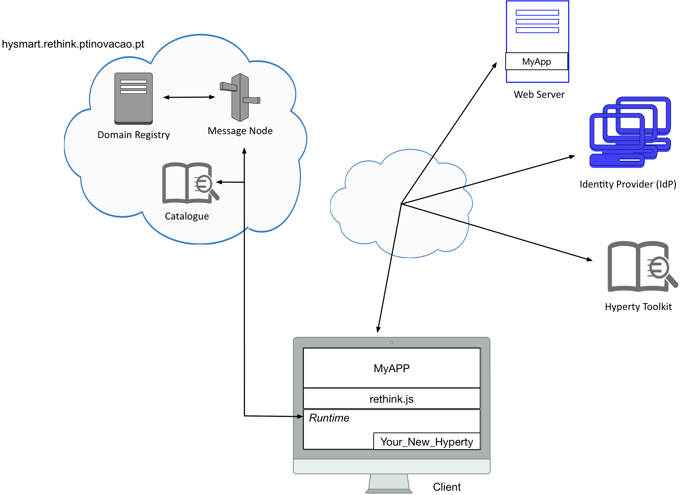

# 5th Challenge

Each team should develop a new hyperty from scratch. The features of this new hyperty are up to each team. Each team is free to design the hyperty, as well as the web application that uses it. We will value teams who try to develop innovative hyperties, in terms of functionalities. 
Read carefully the documentation available at the root of this repository. It will be very useful in order to complete this challenge.

Your feedback is extremely important for us in order to improve the reTHINK framework in the future. As such, after complete all the tasks, each team must fill out the page 6 of this [Survey](https://docs.google.com/forms/d/e/1FAIpQLSeFt56Ura0zkTqg_VX9od_jBZtE3-2mt_urTFvxsoRuQ3uJRw/viewform). 

### Note: If you do not fill out this form, your participation will not be considered! 

##

### [Survey Page 6!!!](https://docs.google.com/forms/d/e/1FAIpQLSeFt56Ura0zkTqg_VX9od_jBZtE3-2mt_urTFvxsoRuQ3uJRw/viewform) 
